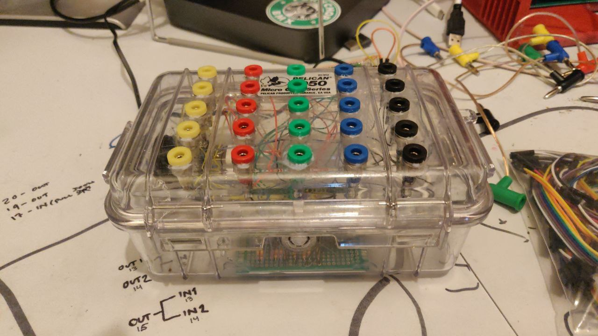

# pico-patchboard

virtual patchboard implemented with a RP2040.



this software is customized for my patchboard, which has 5 outputs on each side of the patchboard (yellow and black columns) and a 3x5 grid of inputs (red, green, and blue columns).

when an input is patched to an output, a "key down" midi event is sent from the device with a pitch equal to the source index and a velocity equal to the destination index. likewise, the "key up" event is used to communicate a disconnect event. i have not currently implemented debouncing so many up/down events may be sent when removing or inserting patch cables.

# compilation

first, build the UF2 file:

```shell
$ cmake .
$ make
```

then while the RP2040 is in `BOOTSEL` mode (accessed by holding the `BOOTSEL` button while the device is being plugged in), copy `patchboard.uf2` to the root of the storage device. it will immediately reboot and load the software.
